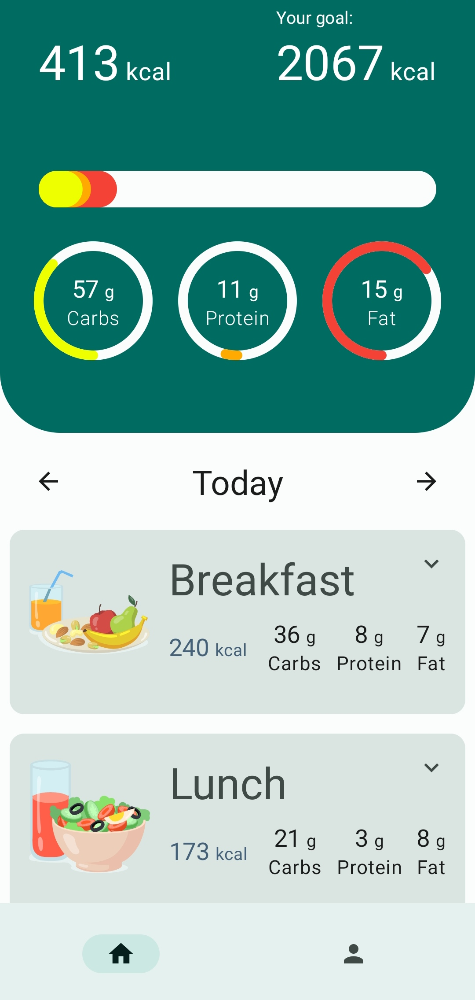
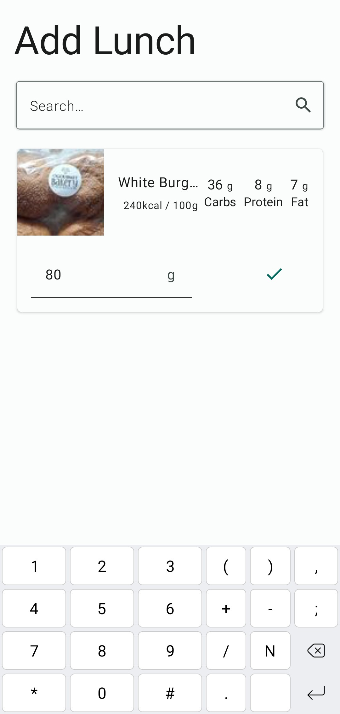
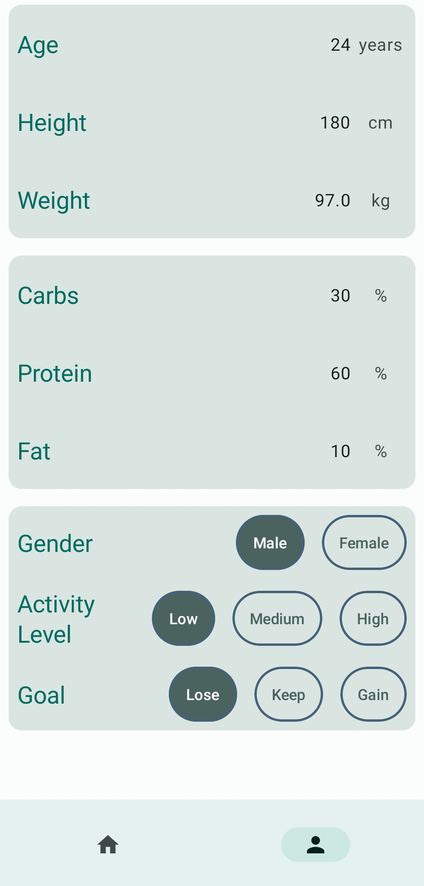

# Calory Tracker

## Description

An example on Multi-Module-Architecture.

This is a simple calory tracker app. It allows you to add, edit and delete meals and track your
daily calory intake.

### Final structure:

```
├── app
├── core
├── core-ui
├── onboarding
│   └── onboarding-presentation
├── profile
│   ├── profile-domain
│   └── profile-presentation
└── tracker
    ├── tracker-data
    ├── tracker-domain
    └── tracker-presentation
```

## Modules Structure

The projuct is structured into Feature-based modules, and each feature module is further divided
into 3 layer modules: data, domain and presentation.

Each module is responsible for a providing dagger module for the feature component.

### Feature-based modules:

#### onboarding

onboarding module is responsible for the information taking process of the app. It contains the
following layer modules:

- onboarding-presentation

#### profile

profile module is responsible for the user profile management. It contains the following layer
modules:

- profile-domain
- profile-presentation

#### tracker

tracker module is responsible for the calory tracking process and search for food of the app. It
contains the following layer modules:

- tracker-data
- tracker-domain
- tracker-presentation

#### core

core module is responsible for the core functionalities of the app.

#### core-ui

core-ui module is responsible for the core UI components of the app.

## Architecture

The project is using MVI architecture with the following components:

- Jetpack Compose
- Material Design 3
- Dagger Hilt
- Kotlin Coroutines
- Room
- Retrofit
- DataStore
- Coil

## Compose

Each presentation module contains compose functions in an isolated way, with preview functions for
each composable.

Also some presentation modules contains a componets package, which contains the composable functions
that are used in multiple screens.

## Screenshots

   

## Certificate

This project is part of the [multi-module course](https://pl-coding.com/multi-module-course) program
by Philipp Lackner.

